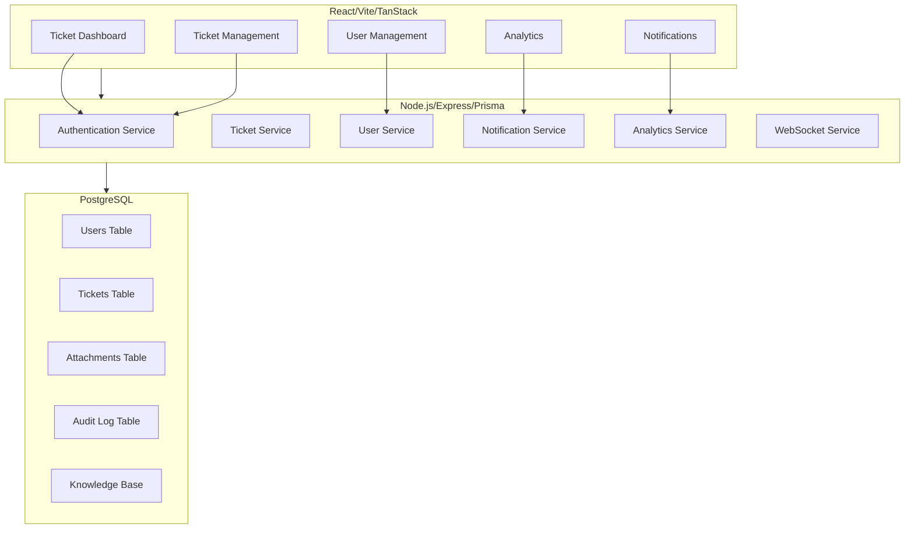

# IT Helpdesk CRM Dashboard - Implementation Plan

## Executive Summary

This document outlines a comprehensive implementation plan for enhancing the existing IT Helpdesk ticketing CRM dashboard. The system will be built on the current technology stack (Node.js/Express/Prisma/PostgreSQL backend, React/Vite/Tailwind/TanStack frontend) following the principles established in the project constitution.

## System Architecture Overview



## Phase 1: Enhanced Ticket Management System (Priority: High)

### Current State Analysis
Based on the existing codebase, the current system has:
- Basic ticket logging (`log_komplain` table)
- Simple CRUD operations without workflow management
- No ticket status tracking or assignment capabilities
- Limited filtering and search functionality

### Implementation Goals
1. Implement comprehensive ticket lifecycle management
2. Add ticket categorization and priority systems
3. Create ticket assignment and escalation workflows
4. Implement ticket status tracking with history
5. Add ticket search and filtering capabilities

### Technical Implementation

#### Backend Enhancements

**1. Enhanced Ticket Model**
```sql
-- Create new ticket_categories table
CREATE TABLE ticket_categories (
  id SERIAL PRIMARY KEY,
  name VARCHAR(100) NOT NULL,
  description TEXT,
  color VARCHAR(7) DEFAULT '#000000',
  icon VARCHAR(50),
  created_at TIMESTAMP DEFAULT NOW()
);

-- Enhance existing log_komplain table
ALTER TABLE log_komplain ADD COLUMN category_id INTEGER REFERENCES ticket_categories(id);
ALTER TABLE log_komplain ADD COLUMN priority INTEGER DEFAULT 3; -- 1=High, 2=Medium, 3=Low
ALTER TABLE log_komplain ADD COLUMN status VARCHAR(20) DEFAULT 'Open'; -- Open, In Progress, Resolved, Closed
ALTER TABLE log_komplain ADD COLUMN assigned_to INTEGER REFERENCES users(id);
ALTER TABLE log_komplain ADD COLUMN estimated_resolution_time INTEGER; -- in hours
ALTER TABLE log_komplain ADD COLUMN actual_resolution_time INTEGER; -- in hours
ALTER TABLE log_komplain ADD COLUMN resolution_summary TEXT;
ALTER TABLE log_komplain ADD COLUMN customer_impact VARCHAR(20); -- High, Medium, Low
ALTER TABLE log_komplain ADD COLUMN tags TEXT[]; -- JSON array of tags
```

**2. Ticket Service Implementation**
```typescript
// backend/src/services/ticket.services.ts
import { prisma } from '../prisma/client';
import { CreateTicketData, UpdateTicketData, TicketFilter, TicketAssignment } from '../types/ticket.types';

export class TicketService {
  // Create new ticket with validation
  async createTicket(data: CreateTicketData) {
    const ticket = await prisma.log_komplain.create({
      data: {
        ...data,
        tiket: await this.generateTicketNumber(),
        status: 'Open',
        created_at: new Date(),
      }
    });
    return ticket;
  }

  // Get tickets with filtering and pagination
  async getTickets(filter: TicketFilter, page: number, limit: number) {
    const where = this.buildWhereClause(filter);
    const tickets = await prisma.log_komplain.findMany({
      where,
      orderBy: { priority: 'asc', created_at: 'desc' },
      skip: (page - 1) * limit,
      take: limit,
      include: {
        category: true,
        assigned_to_user: true,
      }
    });
    return tickets;
  }

  // Assign ticket to user
  async assignTicket(ticketId: number, userId: number, assignment: TicketAssignment) {
    return await prisma.log_komplain.update({
      where: { id: ticketId },
      data: {
        assigned_to: userId,
        status: 'In Progress',
        last_updated: new Date(),
      }
    });
  }

  // Update ticket status with resolution tracking
  async updateTicketStatus(ticketId: number, status: string, resolutionData?: any) {
    const updateData: any = { 
      status,
      last_updated: new Date(),
    };

    if (status === 'Resolved' && resolutionData) {
      updateData.actual_resolution_time = resolutionData.actualTime;
      updateData.resolution_summary = resolutionData.summary;
    }

    return await prisma.log_komplain.update({
      where: { id: ticketId },
      data: updateData,
    });
  }

  // Generate unique ticket numbers
  private async generateTicketNumber(): Promise<string> {
    const prefix = 'TKT';
    const date = new Date().toISOString().slice(0, 10).replace(/-/g, '');
    const random = Math.floor(Math.random() * 1000).toString().padStart(4, '0');
    return `${prefix}${date}${random}`;
  }
}
```

**3. Enhanced Ticket Controller**
```typescript
// backend/src/controllers/ticket.controller.ts
import { Router } from 'express';
import { TicketService } from '../services/ticket.services';
import { validateTicketCreation, validateTicketUpdate } from '../middlewares/validate.middleware';
import { z } from 'zod';

const ticketRouter = Router();

// Create ticket endpoint
ticketRouter.post('/', validateTicketCreation, async (req, res, next) => {
  try {
    const ticket = await TicketService.createTicket(req.body);
    res.status(201).json(ticket);
  } catch (err) { next(err); }
});

// Get tickets with filtering
ticketRouter.get('/', async (req, res, next) => {
  try {
    const { page = 1, limit = 20, category, status, assignedTo, search } = req.query;
    const filter = { category, status, assignedTo, search };
    const tickets = await TicketService.getTickets(filter, parseInt(page), parseInt(limit));
    res.json(tickets);
  } catch (err) { next(err); }
});

// Assign ticket
ticketRouter.patch('/:id/assign', async (req, res, next) => {
  try {
    const { userId, notes } = req.body;
    const ticket = await TicketService.assignTicket(parseInt(req.params.id), userId, { notes });
    res.json(ticket);
  } catch (err) { next(err); }
});

// Update ticket status
ticketRouter.patch('/:id/status', async (req, res, next) => {
  try {
    const { status, resolutionData } = req.body;
    const ticket = await TicketService.updateTicketStatus(parseInt(req.params.id), status, resolutionData);
    res.json(ticket);
  } catch (err) { next(err); }
});

export default ticketRouter;
```

#### Frontend Implementation

**1. Ticket Dashboard Component**
```typescript
// frontend/src/components/ticket/TicketDashboard.tsx
import React, { useState, useEffect } from 'react';
import { useQuery } from '@tanstack/react-query';
import { TicketCard } from './TicketCard';
import { TicketFilters } from './TicketFilters';
import { CreateTicketModal } from './CreateTicketModal';

export const TicketDashboard: React.FC = () => {
  const [filters, setFilters] = useState({
    status: '',
    category: '',
    assignedTo: '',
  });
  const [isCreateModalOpen, setIsCreateModalOpen] = useState(false);

  const { data: tickets, isLoading, error } = useQuery({
    queryKey: ['tickets', filters],
    queryFn: () => fetchTickets(filters),
  });

  return (
    <div className="space-y-6">
      <div className="flex justify-between items-center">
        <h1 className="text-2xl font-bold text-gray-900">Ticket Dashboard</h1>
        <button
          onClick={() => setIsCreateModalOpen(true)}
          className="bg-blue-600 text-white px-4 py-2 rounded-md hover:bg-blue-700"
        >
          Create Ticket
        </button>
      </div>
      
      <TicketFilters filters={filters} onFiltersChange={setFilters} />
      
      <div className="grid grid-cols-1 md:grid-cols-2 lg:grid-cols-3 gap-4">
        {tickets?.map((ticket) => (
          <TicketCard key={ticket.id} ticket={ticket} onUpdate={refetch} />
        ))}
      </div>
      
      {isCreateModalOpen && (
        <CreateTicketModal
          onClose={() => setIsCreateModalOpen(false)}
          onSuccess={() => setIsCreateModalOpen(false)}
        />
      )}
    </div>
  );
};
```

## Phase 2: User Role-Based Access Control (Priority: High)

### Implementation Goals
1. Implement role-based permissions system
2. Create user management interface
3. Add access control to ticket operations
4. Implement audit trail for user actions

### Technical Implementation

#### Backend Enhancements

**1. Enhanced User Model**
```sql
-- Create roles table
CREATE TABLE roles (
  id SERIAL PRIMARY KEY,
  name VARCHAR(50) NOT NULL UNIQUE,
  permissions TEXT[] NOT NULL, -- JSON array of permissions
  description TEXT,
  created_at TIMESTAMP DEFAULT NOW()
);

-- Update users table
ALTER TABLE users ADD COLUMN role_id INTEGER REFERENCES roles(id);
ALTER TABLE users ADD COLUMN is_active BOOLEAN DEFAULT true;
ALTER TABLE users ADD COLUMN last_login TIMESTAMP;
```

**2. Role-Based Middleware**
```typescript
// backend/src/middlewares/role.middleware.ts
import { Request, Response, NextFunction } from 'express';
import { prisma } from '../prisma/client';

export const requireRole = (requiredPermissions: string[]) => {
  return async (req: Request, res: Response, next: NextFunction) => {
    const user = await prisma.users.findUnique({
      where: { id: req.user?.id },
      include: { role: { include: { permissions: true } } }
    });

    if (!user || !user.is_active) {
      return res.status(401).json({ error: 'User not found or inactive' });
    }

    const userPermissions = JSON.parse(user.role.permissions as string);
    const hasPermission = requiredPermissions.every(p => userPermissions.includes(p));

    if (!hasPermission) {
      return res.status(403).json({ 
        error: 'Insufficient permissions',
        required: requiredPermissions,
        current: userPermissions
      });
    }

    req.user = { ...req.user, permissions: userPermissions };
    next();
  };
};
```

#### Frontend Implementation

**1. User Management Component**
```typescript
// frontend/src/components/admin/UserManagement.tsx
import React, { useState } from 'react';
import { useQuery, useMutation, useQueryClient } from '@tanstack/react-query';

export const UserManagement: React.FC = () => {
  const [selectedUser, setSelectedUser] = useState(null);
  const queryClient = useQueryClient();

  const { data: users } = useQuery({
    queryKey: ['users'],
    queryFn: () => fetchUsers(),
  });

  const updateUserRole = useMutation({
    mutationFn: ({ userId, roleId }: { userId: number, roleId: number }) => 
      updateUserRole(userId, roleId),
    onSuccess: () => {
      queryClient.invalidateQueries(['users']);
      setSelectedUser(null);
    },
  });

  return (
    <div className="space-y-6">
      <h2 className="text-xl font-bold">User Management</h2>
      
      <div className="grid grid-cols-1 lg:grid-cols-3 gap-4">
        {users?.map((user) => (
          <div key={user.id} className="bg-white p-6 rounded-lg shadow">
            <h3 className="text-lg font-medium">{user.full_name}</h3>
            <p className="text-sm text-gray-600">Role: {user.role?.name}</p>
            <div className="mt-4 space-y-2">
              <button
                onClick={() => setSelectedUser(user)}
                className="text-blue-600 hover:text-blue-800"
              >
                Edit Role
              </button>
            </div>
          </div>
        ))}
      </div>
      
      {selectedUser && (
        <RoleModal
          user={selectedUser}
          onClose={() => setSelectedUser(null)}
          onRoleUpdate={(roleId) => updateUserRole.mutate({ userId: selectedUser.id, roleId })}
        />
      )}
    </div>
  );
};
```

## Phase 3: Real-Time Notification System (Priority: Medium)

### Implementation Goals
1. Implement WebSocket-based real-time updates
2. Create notification management system
3. Add email/push notification capabilities
4. Implement notification preferences

### Technical Implementation

#### Backend WebSocket Service
```typescript
// backend/src/services/websocket.service.ts
import { Server } from 'socket.io';
import { jwt } from 'jsonwebtoken';

export class WebSocketService {
  private io: Server;

  constructor(server: any) {
    this.io = new Server(server, {
      cors: {
        origin: process.env.FRONTEND_URL,
      },
    });
    
    this.setupAuthentication();
    this.setupTicketEvents();
    this.setupNotificationEvents();
  }

  private setupAuthentication() {
    this.io.use(async (socket, next) => {
      try {
        const token = socket.handshake.auth.token;
        const decoded = jwt.verify(token, process.env.JWT_SECRET) as any;
        socket.userId = decoded.id;
        socket.join(`user_${decoded.id}`);
        next();
      } catch (err) {
        next(new Error('Authentication error'));
      }
    });
  }

  private setupTicketEvents() {
    this.io.on('ticket:update', (data) => {
      this.io.to(`user_${data.assignedTo}`).emit('ticket:updated', data);
      this.io.to('admin_users').emit('ticket:updated', data);
    });

    this.io.on('ticket:assigned', (data) => {
      this.io.to(`user_${data.assignedTo}`).emit('ticket:assigned', data);
    });
  }

  private setupNotificationEvents() {
    this.io.on('notification:send', async (data) => {
      const notification = await NotificationService.create(data);
      this.io.to(`user_${data.userId}`).emit('notification:new', notification);
    });
  }
}
```

## Phase 4: Analytics and Reporting Dashboard (Priority: Medium)

### Implementation Goals
1. Create comprehensive analytics dashboard
2. Implement ticket performance metrics
3. Add SLA tracking and reporting
4. Create exportable reports

### Technical Implementation

#### Backend Analytics Service
```typescript
// backend/src/services/analytics.service.ts
export class AnalyticsService {
  async getTicketMetrics(timeRange: string) {
    // Calculate metrics from ticket data
    const metrics = await prisma.log_komplain.aggregate({
      where: {
        created_at: {
          gte: new Date(timeRange.start),
          lte: new Date(timeRange.end),
        },
      },
      _count: {
        id: true,
        status: true,
        category: true,
      },
      _avg: {
        actual_resolution_time: true,
      },
    });

    return {
      totalTickets: metrics._count.id,
      ticketsByStatus: metrics._count.status,
      ticketsByCategory: metrics._count.category,
      averageResolutionTime: metrics._avg.actual_resolution_time,
      slaCompliance: await this.calculateSLA(metrics),
    };
  }

  async getSLAReport(timeRange: string) {
    // Calculate SLA compliance metrics
    const tickets = await prisma.log_komplain.findMany({
      where: {
        created_at: {
          gte: new Date(timeRange.start),
          lte: new Date(timeRange.end),
        },
        priority: 1, // High priority tickets
      },
    });

    const slaMetrics = {
      totalHighPriority: tickets.length,
      resolvedWithinSLA: tickets.filter(t => 
        t.status === 'Resolved' && 
        this.calculateSLADifference(t.created_at, t.last_updated) <= 24
      ).length,
      slaComplianceRate: (tickets.filter(t => 
        t.status === 'Resolved' && 
        this.calculateSLADifference(t.created_at, t.last_updated) <= 24
      ).length / tickets.length) * 100,
    };

    return slaMetrics;
  }

  private calculateSLADifference(created: Date, resolved: Date): number {
    const diffHours = (resolved.getTime() - created.getTime()) / (1000 * 60 * 60);
    return Math.max(0, 24 - diffHours); // 24 hours SLA
  }
}
```

## Implementation Timeline

### Phase 1 (Weeks 1-2): Foundation
- Week 1: Database schema updates and basic ticket management
- Week 2: User authentication and role system

### Phase 2 (Weeks 3-4): Core Features
- Week 3: Real-time notifications and WebSocket implementation
- Week 4: Analytics dashboard and reporting

### Phase 3 (Weeks 5-6): Advanced Features
- Week 5: Knowledge base integration
- Week 6: File attachments and mobile optimization

### Phase 4 (Weeks 7-8): Polish and Deployment
- Week 7: Comprehensive testing and bug fixes
- Week 8: Performance optimization and deployment

## Success Metrics

### Technical Metrics
- API response time < 200ms for 95% of requests
- Database query optimization with proper indexing
- Frontend bundle size < 2MB
- Mobile page load time < 3 seconds
- WebSocket latency < 50ms

### Business Metrics
- Ticket resolution time reduced by 30%
- SLA compliance rate > 95%
- User satisfaction score > 4.5/5
- Support ticket volume handled increased by 50%

## Risk Assessment and Mitigation

### Technical Risks
1. Database performance issues with large datasets
   - Mitigation: Implement proper indexing and query optimization
2. WebSocket scalability challenges
   - Mitigation: Implement connection pooling and load balancing
3. Frontend bundle size growth
   - Mitigation: Code splitting and lazy loading

### Business Risks
1. User adoption resistance
   - Mitigation: Comprehensive training and gradual rollout
2. Data migration challenges
   - Mitigation: Phased migration with rollback capability

## Resource Requirements

### Development Team
- Backend Developer (1): Node.js/Express/Prisma expertise
- Frontend Developer (1): React/TanStack/Tailwind expertise
- Full-Stack Developer (1): Both frontend and backend capabilities
- QA Engineer (1): Testing and automation expertise

### Infrastructure
- Development Environment: Docker containers for consistency
- Database: PostgreSQL 14+ with proper indexing
- CI/CD: GitHub Actions with automated testing and deployment
- Monitoring: Application performance monitoring and error tracking

This implementation plan provides a comprehensive roadmap for transforming the basic ticketing system into a full-featured IT Helpdesk CRM dashboard while maintaining the existing technology stack and following the established constitution principles.